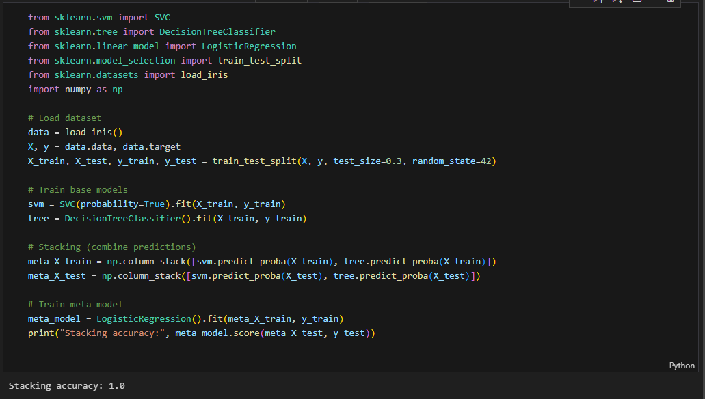

# 1. Stacking

> File:　[stack.ipynb]

在 Iris 資料集中使用 `SVM` 以及 `Regression` 進行分類並堆疊，最終使用 `Linear Regression` 進行學習。

## Result



# 2. LSTM + CNN

> File:　[LstmCnn.ipynb]

在 **MNIST 資料集** 中使用 `LSTM` 以及 `CNN` 進行分類。

## Model

CNN 負責提取特徵：
影像資料首先透過影像圖層進行處理，擷取影像的空間特徵。

LSTM 負責處理序列資料：
CNN 輸出的特徵和影像原始的行資料（即每行 28 個像素）可以被視為一個序列輸入 LSTM。

合併 CNN 和 LSTM 的輸出：
CNN 和 LSTM 的輸出透過 torch.cat 連接起來，形成一個大的特徵分析。

```python
class CNN_LSTM(nn.Module):
    def __init__(self, cnn, lstm):
        super(CNN_LSTM, self).__init__()
        self.cnn = cnn
        self.lstm = lstm
        self.fc = nn.Linear(128 + 10, 10)  # Adjust output dimensions as necessary

    def forward(self, x_img, x_seq):
        x_cnn = self.cnn(x_img)
        x_lstm = self.lstm(x_seq)
        x = torch.cat((x_cnn, x_lstm), dim=1)
        x = self.fc(x)
        return x
```

## Result

> Epoch 1/10, Loss: 0.3241, Accuracy: 90.24%
> Validation Accuracy: 95.93%
>
> Epoch 2/10, Loss: 0.1002, Accuracy: 96.96%
> Validation Accuracy: 97.47%
>
> Epoch 3/10, Loss: 0.0608, Accuracy: 98.15%
> Validation Accuracy: 98.67%
>
> Epoch 4/10, Loss: 0.0447, Accuracy: 98.62%
> Validation Accuracy: 98.97%
>
> Epoch 5/10, Loss: 0.0333, Accuracy: 98.95%
> Validation Accuracy: 98.98%
>
> Epoch 6/10, Loss: 0.0274, Accuracy: 99.17%
> Validation Accuracy: 99.22%
>
> Epoch 7/10, Loss: 0.0212, Accuracy: 99.36%
> Validation Accuracy: 99.62%
>
> Epoch 8/10, Loss: 0.0165, Accuracy: 99.52%
> Validation Accuracy: 99.65%
>
> Epoch 9/10, Loss: 0.0145, Accuracy: 99.55%
> Validation Accuracy: 99.79%
>
> Epoch 10/10, Loss: 0.0107, Accuracy: 99.66%
> Validation Accuracy: 99.87%
>
> Test Loss: 0.0426, Test Accuracy: 98.70%

測試集上的準確率為 98.70%，這表明模型具有優秀的泛化能力，並且能夠很好地處理新數據。

# 3. LSTM

> File:　[Lstm.ipynb]

在 **MNIST 資料集** 中使用 `LSTM` 進行分類。

## Result

> Epoch 1/10, Loss: 0.0500, Accuracy: 98.50%
>
> Epoch 2/10, Loss: 0.0417, Accuracy: 98.70%
>
> Epoch 3/10, Loss: 0.0344, Accuracy: 98.95%
>
> Epoch 4/10, Loss: 0.0328, Accuracy: 98.99%
>
> Epoch 5/10, Loss: 0.0274, Accuracy: 99.11%
>
> Epoch 6/10, Loss: 0.0255, Accuracy: 99.17%
>
> Epoch 7/10, Loss: 0.0227, Accuracy: 99.26%
>
> Epoch 8/10, Loss: 0.0192, Accuracy: 99.39%
>
> Epoch 9/10, Loss: 0.0188, Accuracy: 99.39%
>
> Epoch 10/10, Loss: 0.0165, Accuracy: 99.49%
>
> Test Accuracy: 98.73%
