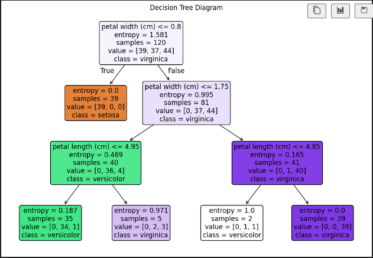
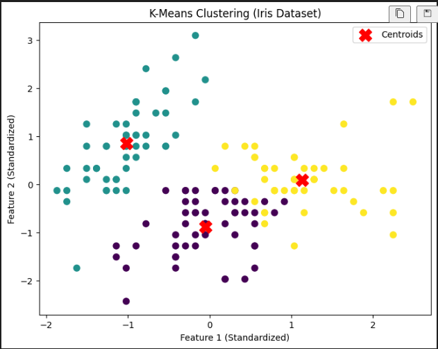

# Decision Tree.ipynb

> Requirement: Use Iris dataset to validate decision tree and further derive tree diagram.

在 Iris 資料集中使用 `Decision Tree`進行決策。

## Model

```python
# Create a decision tree classifier
tree_clf = DecisionTreeClassifier(criterion='entropy', max_depth=3, random_state=0)
tree_clf.fit(X_train, y_train)

# Predict the test data
y_pred = tree_clf.predict(X_test)
accuracy = accuracy_score(y_test, y_pred)
```

## Validation

```bash
Decision Tree Accuracy: 0.97
```

## Decision Tree Visualization



# K-Means.ipynb

> Requirement: Use k-mean to see the variable prediction power by Iris dataset.

在 Iris 資料集中使用 `K-Means` 進行分群。

## Model

```python
# Create a KMeans model
kmeans = KMeans(n_clusters=3, random_state=0)
kmeans.fit(X_scaled)
```

## Validation

Silhouette Score 輪廓係數評估：0.46，範圍為[-1 ,1]，越接近 1 越好，這次分群算有效分群。

```bash
K-Means Accuracy: 0.83
Silhouette Score: 0.46
```

## Visualization


